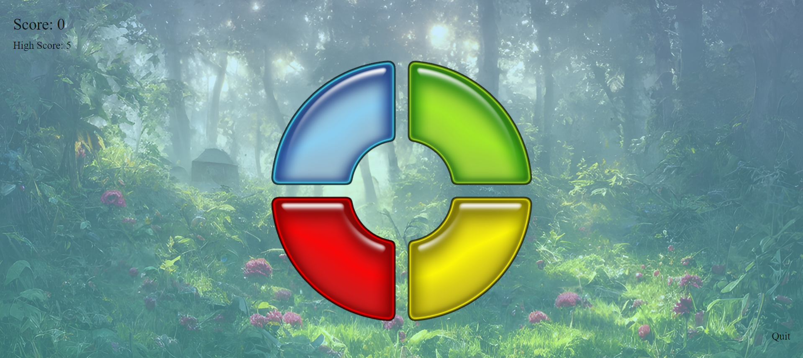

# Simon Says Game

## Overview
This is a **Simon Says** game built with a modern tech stack, offering an interactive and responsive experience. The game challenges players to repeat sequences of colors and sounds that get progressively longer. It’s designed with a **React** frontend and **Sass** for styling. The game tracks high scores using a **TypeScript** backend that stores high scores in a **JSON** file and communicates via **Axios** for API requests.


## Features
- **Interactive Gameplay**: Players repeat color sequences that increase in difficulty with each round.
- **Real-time Feedback**: Colors flash and corresponding sounds play as the player interacts.
- **High Score Tracking**: The game stores and retrieves the highest score from a JSON file using **Axios**.
- **Responsive Design**: The layout adjusts seamlessly to different screen sizes for an optimal experience.
- **React State Management**: The game’s logic, including the sequence, user input, and score, is managed using **React** hooks and state.



## Game Flow
1. **Game Start**:
   - A random sequence of colors flashes on the screen.
   - The player needs to repeat the sequence by clicking the colored buttons in the correct order.

2. **Gameplay**:
   - After each correct round, the sequence increases by one additional step, and the player must follow the entire sequence.
   - If the player clicks the wrong button, the game ends, and their score is recorded.

3. **End Game**:
   - If the player achieves a new high score, it is saved to the backend.

4. **Restart**:
   - The player can restart the game to try to beat their previous score.

## Technologies Used

### Frontend
- **React & Node.js**: Used to build the interactive UI and manage game logic.
- **Sass (SCSS)**: Provides advanced styling features such as variables, nesting, and mixins for a maintainable and responsive design.
- **Axios**: Handles API requests for high score retrieval and submission.

### Backend
- **TypeScript**: The backend server that handles API requests and manages high scores.
- **JSON**: Used to store high scores in a simple, structured format.

## How to Run the Project

Head to the repository on top and clone the project or download the files.

```
git clone https://github.com/MoriaHamami/Simon-Says.git
```

Enter the backend folder and make sure you have node_modules installed. After that we will initiate the server with 'npm start':

```
cd backend
npm i 
npm start
```

You should get a console output that the server is up and running at port 3030.
Enter the frontend folder and repeat the same process.

```
cd ..
cd frontend
npm i 
npm start
```

You should get a console output that the server is up and running at localhost:3000.

That's it! The App should be up, running, and open on the web, enjoy!
